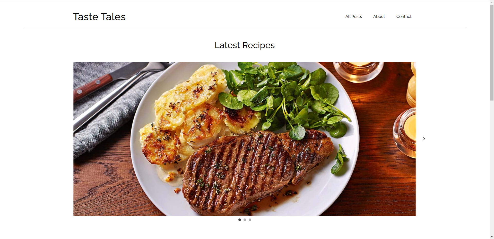

# Taste Tales



This is the food blog Taste Tales where users can visit to find a variety of recipes.

## Description

Taste Tales is a food blog that will dynamically update itself as new dishes and recipes are added in the database.
Javascript is used to fetch data from a rest API, and then automatically puts it up on the site. Users can see the latest recipes on the homepage. They will also be able to view every blog post when they click on "All posts", and this page will keep adding more recipes automatically when new recipes are added to the database. Clicking on any recipe will bring the user to the recipe page, and this site is built dynamically using Javascript based on the recipe you clicked on.

## Built With

- HTML
- CSS
- Javascript
- [Wordpress] (https://wordpress.org/)

## Getting Started

### Installing

This is where you list how to get the project started. It typically just includes telling a person to clone the repo and then to install the dependencies e.g.

1. Clone the repo:

```bash
git clone https://github.com/Noroff-FEU-Assignments/project-exam-1-Sondre198/tree/main
```

2. Install the dependencies:

```
npm install
```

### Running

To run the app, run the following commands:

```bash
npm run start
```

## Contact

Here is my email address if you would like to contact me:

sondre.lie@hotmail.no
